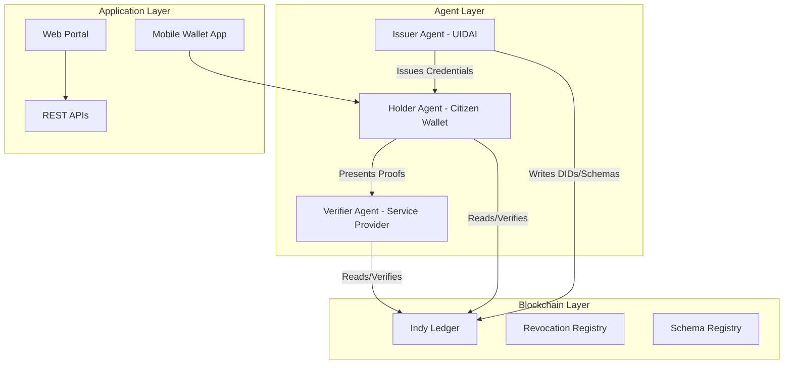
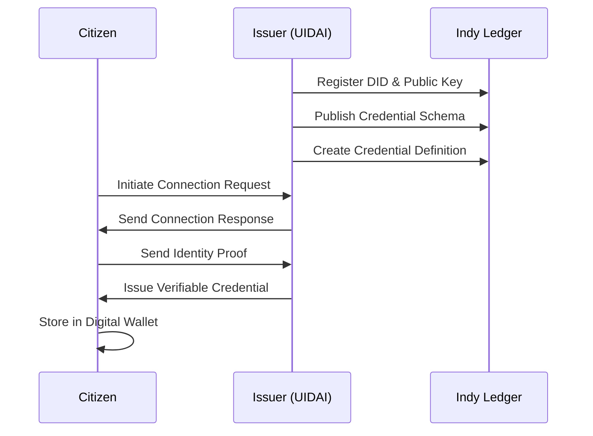
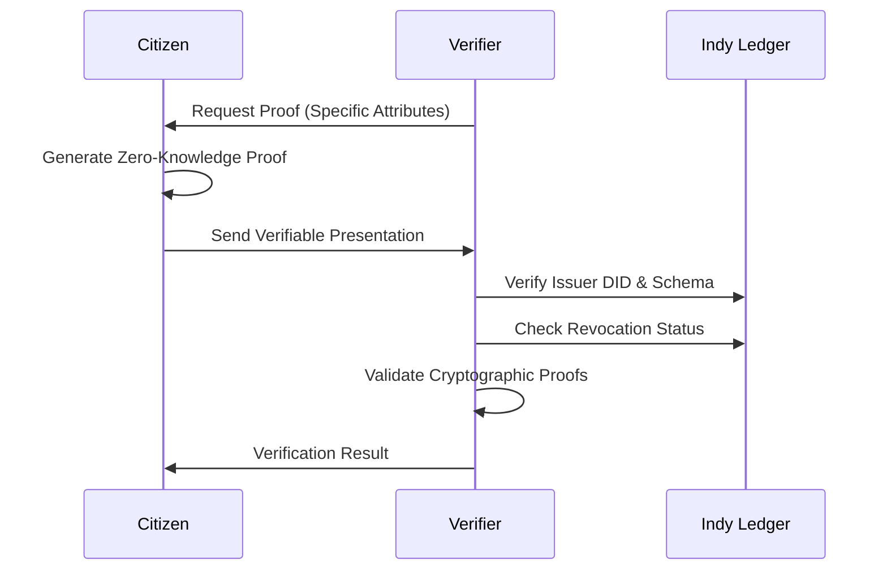

# 🇮🇳 Decentralized Aadhaar Identity System using Hyperledger Indy

> A privacy-preserving, self-sovereign identity framework that reimagines India's Aadhaar infrastructure with blockchain technology

---

## 📖 Table of Contents
- [Overview](#-overview)
- [Problem Statement](#-problem-statement)
- [Solution Architecture](#-solution-architecture)
- [Protocol Flow](#-protocol-flow)
- [Key Features](#-key-features)
- [Technical Stack](#-technical-stack)
- [Project Structure](#-project-structure)
- [Installation & Setup](#-installation--setup)
- [Usage Guide](#-usage-guide)
- [API Documentation](#-api-documentation)
- [Security Considerations](#-security-considerations)
- [Future Roadmap](#-future-roadmap)
- [Contributing](#-contributing)
- [License](#-license)
- [Team](#-team)
- [Acknowledgements](#-acknowledgements)
- [Support & Contact](#-support--contact)

---

## 🎯 Overview

This project implements a **decentralized Aadhaar-based identity system** using **Hyperledger Indy** and **Aries framework**, transforming India's centralized identity infrastructure into a **self-sovereign identity (SSI)** ecosystem.  
The system empowers citizens with full control over their identity data while maintaining trust and verification capabilities similar to the original Aadhaar system.

### Core Principles
- **User Sovereignty**: Citizens own and control their identity data  
- **Privacy by Design**: Zero-knowledge proofs enable selective disclosure  
- **Decentralized Trust**: No single point of failure or control  
- **Interoperability**: Standards-based implementation using W3C DIDs and VCs  

---

## ⚠️ Problem Statement

The current Aadhaar system faces **security, privacy, and operational** challenges.

### 🔒 Security Concerns
- Centralized UIDAI databases → single point of failure  
- Risk of mass surveillance and data breaches  
- Insider threats from privileged access  

### 🕵️ Privacy Limitations
- Citizens lack control over their personal data  
- Mandatory full disclosure for verification  
- Permanent, traceable data trails  

### ⚙️ Operational Challenges
- Downtime impacts all services  
- No offline verification mechanism  
- Lack of consent-based data sharing  

---

## 🏗️ Solution Architecture

### System Overview



---

## 🧩 Protocol Flow

### 1️⃣ Credential Issuance



### 2️⃣ Identity Verification



---

## ✨ Key Features

### 🔐 Privacy-Preserving Verification
- Zero-Knowledge Proofs and Selective Disclosure  
- No personal data on blockchain  
- User consent before sharing data  

### 🛡️ Enhanced Security
- Fully decentralized, no central database  
- Strong cryptography (ed25519, BLS12-381)  
- Real-time credential revocation  

### 📱 Citizen Empowerment
- Mobile Digital Wallet for SSI credentials  
- Biometric protection & consent-based sharing  
- Traceable yet unlinkable verifications  

---

## 🛠️ Technical Stack

| Layer | Technology |
|-------|-------------|
| **Ledger** | Hyperledger Indy |
| **Agents** | Hyperledger Aries |
| **Credentials** | AnonCreds (Zero-Knowledge Protocol) |
| **Backend** | Node.js, Python |
| **Mobile** | React Native / Flutter |
| **Database** | PostgreSQL |
| **Security** | libsodium, AES-256-GCM, BLS12-381 |
| **Infrastructure** | Docker, Docker Compose |

---

## 📁 Project Structure

```
aadhaar-ssi-indy/
├── ledger-network/
│   ├── docker-compose.yml
│   └── config/
│       └── pool_transactions_genesis
├── issuer-agent/
│   ├── src/
│   ├── config/
│   └── package.json
├── verifier-agent/
│   ├── src/
│   └── package.json
├── wallet-app/
│   ├── src/
│   └── package.json
├── schemas/
│   ├── aadhaar-credential.json
│   └── kyc-credential.json
├── docs/
│   ├── architecture.md
│   ├── api-reference.md
│   └── deployment-guide.md
└── scripts/
    ├── setup.sh
    └── deploy.sh
```

---

## 🚀 Installation & Setup

### Prerequisites
- Docker, Node.js, Python  
- Android/iOS dev environment

### Steps
```bash
git clone https://github.com/your-org/aadhaar-ssi-indy.git
cd aadhaar-ssi-indy

# Start Indy Ledger
cd ledger-network && docker-compose up -d

# Setup Issuer Agent
cd ../issuer-agent && npm install && npm start

# Setup Verifier Agent
cd ../verifier-agent && npm install && npm start

# Run Wallet App
cd ../wallet-app && npm install && npm run android
```

---

## 📖 Usage Guide

### Citizens
- Install wallet app → scan QR → receive Aadhaar credential  
- Use selective disclosure during verification  

### Service Providers
```javascript
npm install @aadhaar-ssi/verifier-sdk

const verifier = new AadhaarVerifier({ ledgerUrl: 'http://localhost:9000' });
const result = await verifier.verifyCredential({ name: true, ageAbove: 18 });
```

---

## 🔌 API Documentation

| Endpoint | Method | Description |
|-----------|---------|-------------|
| `/api/v1/did/create` | POST | Create new DID |
| `/api/v1/schema/create` | POST | Register schema |
| `/api/v1/credential/issue` | POST | Issue credential |
| `/api/v1/credential/revoke` | POST | Revoke credential |
| `/api/v1/verify/proof` | POST | Verify credential proof |

---

## 🛡️ Security Considerations

- Pairwise DIDs for unlinkability  
- No PII on ledger, only public keys and schemas  
- AES-256 encrypted wallets  
- GDPR and Aadhaar Act compliant  

---

## 🗺️ Future Roadmap

| Phase | Focus |
|--------|--------|
| Phase 1 | Core Indy setup & ZKP integration |
| Phase 2 | Offline verification & biometric wallet |
| Phase 3 | Integration with IndiaStack APIs |
| Phase 4 | Quantum-resistant credentials & cross-border IDs |

---

## 🤝 Contributing

Contributions are welcome! Fork, create a branch, and submit a PR.  
Ensure tests and docs are updated accordingly.

---

## 📜 License

Licensed under **MIT License**. See LICENSE file for details.

---

## 👥 Team

- **Mahim Yadav (2023UEE0142)** — Mobile Application  
- Anshak (2023UEE0128) — Blockchain Architecture  
- Aaryan Bansal (2023UMA0200) — Backend Development  
- Drish Mahajan (2023UEE0133) — Security & Cryptography  

**Faculty Advisor:** Dr. Harkefrat Kaur — IIT Jammu

---

## 🙏 Acknowledgements

- Hyperledger & Sovrin Foundations  
- Government of India — UIDAI  
- IIT Jammu, Ministry of Education  
- W3C — DIDs & VCs standards  

---

## 📞 Support & Contact

- **Email**: 2023uee0142@iitjammu.ac.in  
- **GitHub Issues**: [Open Issues](https://github.com/your-org/aadhaar-ssi-indy/issues)  
- **Discussions**: [Join Discussion](https://github.com/your-org/aadhaar-ssi-indy/discussions)

---

> **Empowering 1.4 billion Indians with privacy-first, self-sovereign digital identity. 🇮🇳**  
> *"Technology should empower, not enslave. Privacy should be default, not premium."*
